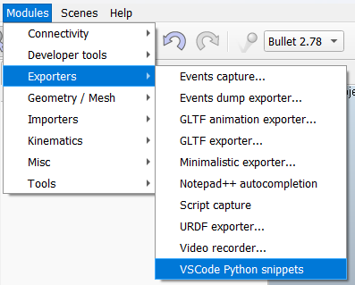
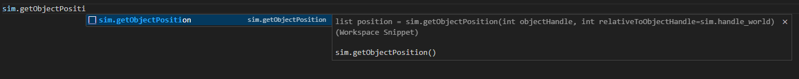

---

# CoppeliaSim Python Snippets for VSCode

This repository provides a **CoppeliaSim add-on** that automatically exports all available CoppeliaSim API functions and constants as **Python snippets for Visual Studio Code**.
With these snippets, you get autocomplete-like suggestions when coding against the Remote API in Python.

---

## 📦 Installation

There are two ways to install the snippets:

### Option 1 – Generate your own snippets

1. Download the `VScode python snippets.lua` file.
2. Copy the file into your CoppeliaSim `addOns/` folder.
3. Start CoppeliaSim and go to **Modules → Exporters → VScode Python Snippets**.
   
   

4. A `.code-snippets` file will be generated in the same directory where CoppeliaSim was launched.
5. Copy the generated file into your VSCode user snippets folder:

   * **Global**: `%APPDATA%\Code\User\snippets\`
   * **Workspace**: `WorkingDirectory\.vscode\`

### Option 2 – Use pre-generated snippets

Instead of generating them yourself, you can simply download one of the provided `.code-snippets` files from this repository and place it directly into your VSCode snippets folder (see step 5 above).

---

## 🖼 Example

Typing `sim.setO` in VSCode will expand to:

```python
sim.setObjectPosition(, )
```

* The snippet includes placeholders **only for mandatory parameters**.  
* You can still check the function description tooltip for the complete list of parameters and the return values with their types.  


  

---
